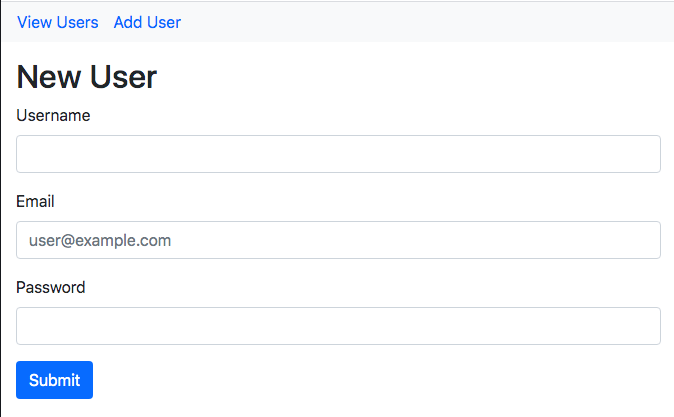

# RE-FORMER

## About

Re-former is a very simple rails application that creates, updates and displays users. It is part of The Odin Project's Ruby on Rails Curriculum (http://www.theodinproject.com) and focusses on building basic forms using both HTML and helper methods provided by Rails.




## How to Use

```
$ git clone https://github.com/HannaEb/re-former.git
$ cd re-former
$ bundle
$ rake db:migrate
$ rails server
```
In your browser, enter http://localhost:3000/


## Testing

RSpec-Capybara. To run all the tests, simply run rspec in your terminal.


## Author

HannaEb
